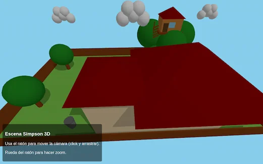

# Parrilla Amarilla

## Descripción

**Parrilla Amarilla** es un proyecto web en 3D inspirado en el patio de la icónica serie _The Simpsons_.  
Está desarrollado con **Three.js**, incorporando animaciones, manejo de objetos en 3D y texturas personalizadas para recrear un entorno nostálgico y familiar.



---

## Tecnologías utilizadas

- **HTML5**
- **JavaScript**
- **Three.js** (motor 3D en WebGL)
- **GIMP / Photoshop** para la edición de texturas
- Recursos y herramientas de texturizado disponibles en la web

---

## Características

- Escena 3D interactiva en el navegador.
- Recreación de la casa y patio de los Simpson.
- Uso de texturas personalizadas para mayor realismo.
- Animaciones y manejo de objetos en tiempo real.

---

## Cómo probarlo

1. Clona este repositorio:
   ```bash
   git clone https://github.com/TU_USUARIO/Parrilla_amarilla.git
   ```
2. cd Parrilla_amarilla

3. Instala las dependencias:
   ```bash
   npm install
   ```
4. Inicia el servidor de desarrollo:
   ```bash
   npm run dev
   ```

## info

- Este proyecto es de uso libre para fines educativos y de experimentación.
- Create: Jahirwh
